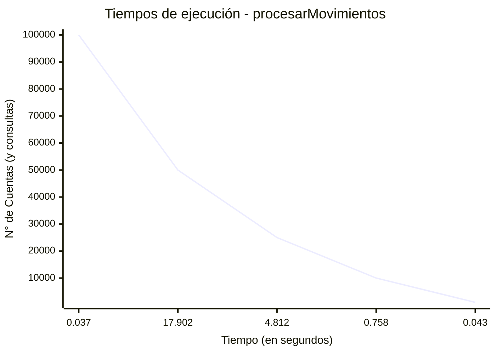
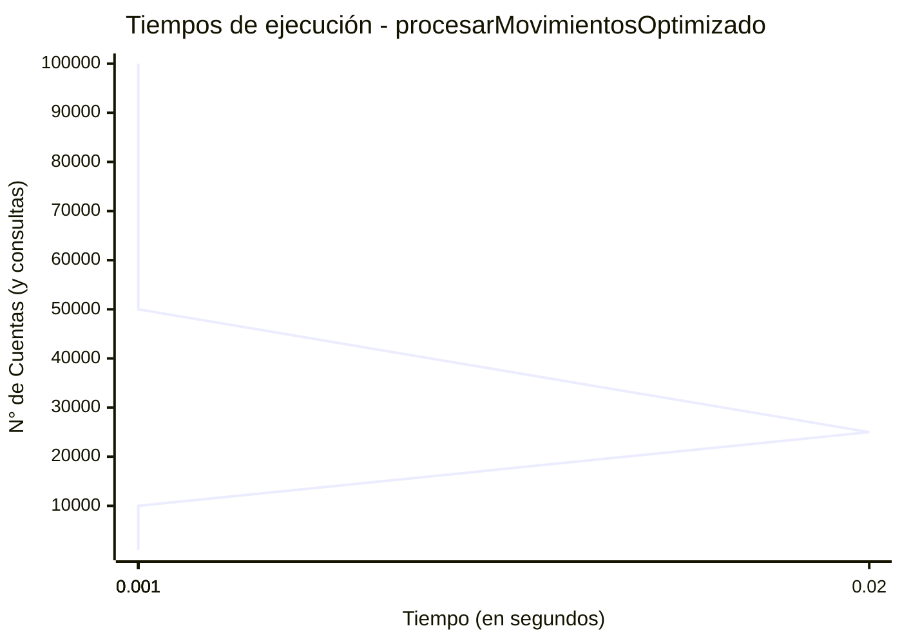

# Ejercicio 1
### Inciso a: tabla de tiempos de ejecución

| N° cuentas (y consultas) | procesarMovimientos | procesarMovimientosOptimizado |
|--------------------------|---------------------|-------------------------------|
| 1.000                    | 0.043 segundos      | 0.001 segundos                |
| 10.000                   | 0.758 segundos      | 0.001 segundos                |
| 25.000                   | 4.812 segundos      | 0.02 segundos                 |
| 50.000                   | 17.902 segundos     | 0.034 segundos                |
| 100.000                  | 0.037 segundos      | 0.001 segundos                |

### Inciso b

