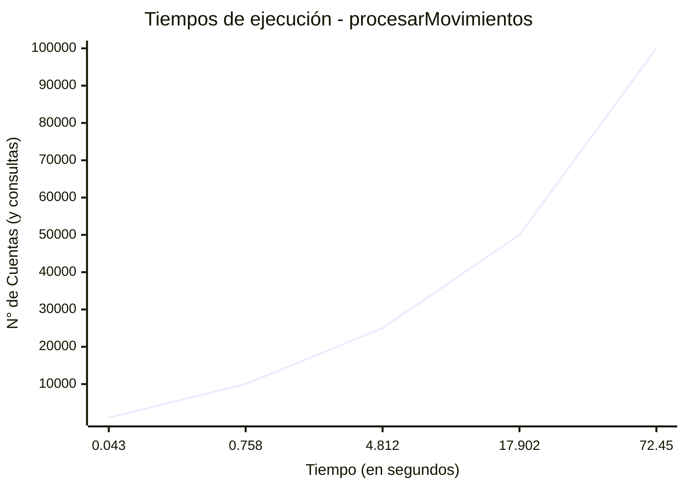
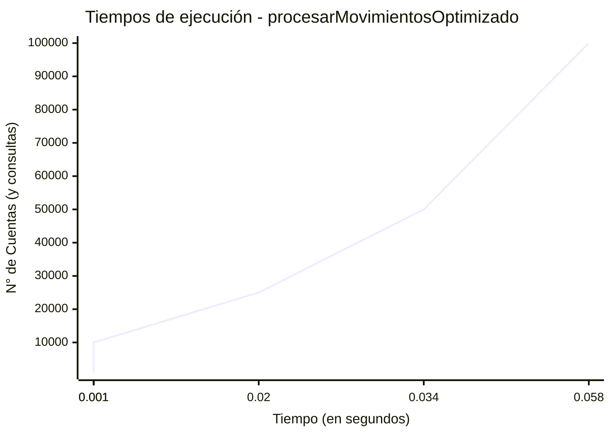

## Ejercicio 1

---
### Inciso a: tabla de tiempos de ejecución

| N° cuentas (y consultas) | procesarMovimientos | procesarMovimientosOptimizado |
|--------------------------|---------------------|-------------------------------|
| 1.000                    | 0.043 segundos      | 0.001 segundos                |
| 10.000                   | 0.758 segundos      | 0.001 segundos                |
| 25.000                   | 4.812 segundos      | 0.02 segundos                 |
| 50.000                   | 17.902 segundos     | 0.034 segundos                |
| 100.000                  | 72.45 segundos      | 0.058 segundos                |

---
### Inciso b 

- [ ] CONSULTAR: se puede decir que es de orden cuadratico?

Si bien el arreglo de consultas se recorre una vez, es decir n = ``consultas.length``,
el arreglo de cuentas se recorre j veces, siendo j el numero de consultas que haya, llegando a tener un orden, dependiendo de n * m.

---
### Incico c
La mejora en la eficiencia viene dada por el recorrido de n, o ``consultas.length``, y j, o ``cuentas.length``.
Es decir, no son ``for`` anidados como el caso anterior, por lo que esta función tiene un orden lineal
O(n+j).

---

## Ejercicio 2

---

| N       | Lineal | Dicotómica |
|---------|--------|------------|
| 100.000 | 2      | 0          |
| 200.000 | 3      | 0          |
| 300.000 | 3      | 0          |
| 400.000 | 4      | 0          |
| 500.000 | 5      | 0          |
| 600.000 | 7      | 0          |

---

## Ejercicio 3

---
