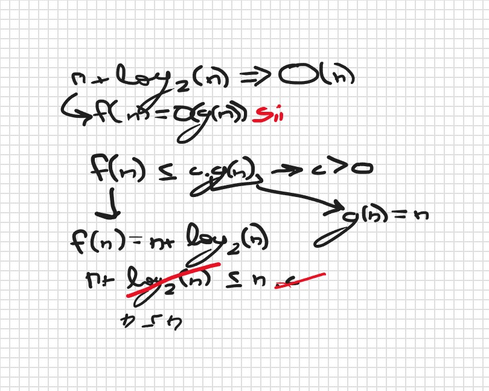
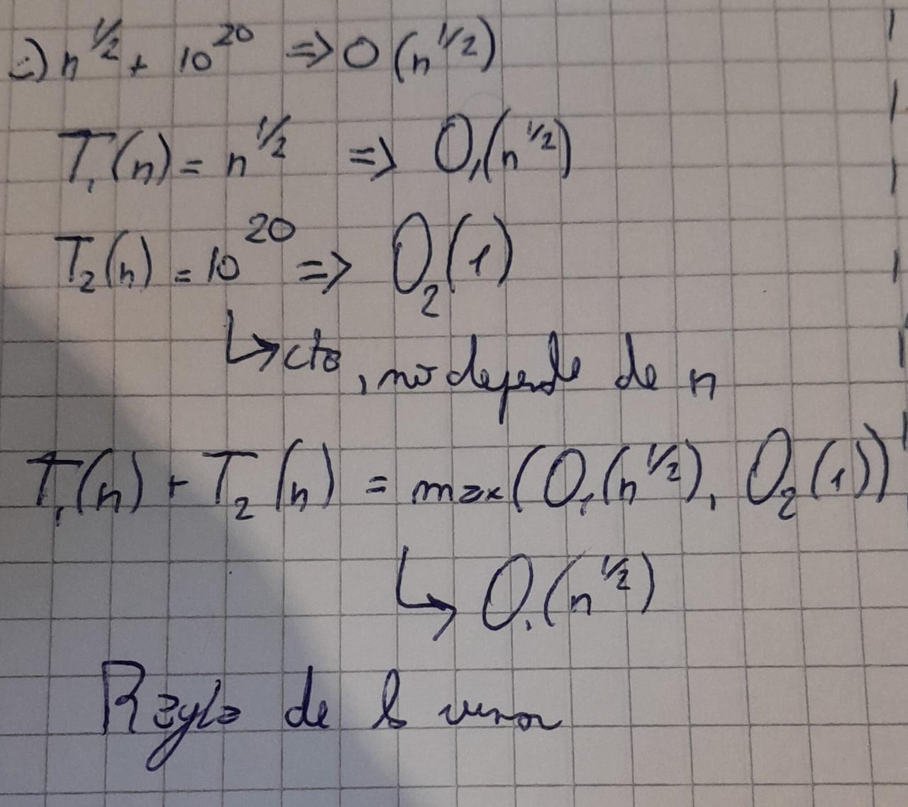

## Ejercicio 1

---
### Inciso a: tabla de tiempos de ejecución

| N° cuentas (y consultas) | procesarMovimientos | procesarMovimientosOptimizado |
|--------------------------|---------------------|-------------------------------|
| 1.000                    | 0.043 segundos      | 0.001 segundos                |
| 10.000                   | 0.758 segundos      | 0.001 segundos                |
| 25.000                   | 4.812 segundos      | 0.02 segundos                 |
| 50.000                   | 17.902 segundos     | 0.034 segundos                |
| 100.000                  | 72.45 segundos      | 0.058 segundos                |

---
### Inciso b 

- [ ] CONSULTAR: se puede decir que es de orden cuadratico?

Si bien el arreglo de consultas se recorre una vez, es decir n = ``consultas.length``,
el arreglo de cuentas se recorre j veces, siendo j el numero de consultas que haya, llegando a tener un orden, dependiendo de n * m.

---
### Incico c
La mejora en la eficiencia viene dada por el recorrido de n, o ``consultas.length``, y j, o ``cuentas.length``.
Es decir, no son ``for`` anidados como el caso anterior, por lo que esta función tiene un orden lineal
O(n+j).

---

## Ejercicio 2

---

| N       | Lineal | Dicotómica |
|---------|--------|------------|
| 100.000 | 2      | 0          |
| 200.000 | 3      | 0          |
| 300.000 | 3      | 0          |
| 400.000 | 4      | 0          |
| 500.000 | 5      | 0          |
| 600.000 | 7      | 0          |

---

## Ejercicio 3

---

El primer conjunto de operaciones posee un **tiempo constante** ya que son operaciones de asignación, comparación, etc,
operaciones que si los vemos en tiempo de ejecución, no son afectados por el valor de entrada, es decir, ``n``, por lo 
que se puede decir que cada operación equivale a 1p. Son operaciones a ejecutar en un número fijo de pasos.

Por otro lado, las operaciones restantes posee un **tiempo lineal**, ya que dependen de la longitud del ArrayList. Por
 ejemplo, el agregar un elemento al final de la lista va a depender de la longitud de nuestro ArrayList, teniendo que 
recorrer ``n=ArrayList.length`` elementos para poder agregar el nuevo. Aumenta la cantidad de operaciones necesarias de 
manera proporcional al tamaño de la estructura.

---

## Ejercicio 4

---
a) 3^n → O(2^n)

&nbsp;&nbsp;&nbsp;Esto es falso, ya que la funcion T(n)=3^n tiene un crecimiento mayor que la funcion g(n) = 2^n.
Es decir, basandonos en la notación **Big O**, podemos decir que f(n)=2^n y T(n) = 3^n, pero no se cumple que T(n) tenga
ese orden de crecimiento.

b) n+ log2 (n) es de O(n)

Teniendo en cuenta la notación **Big O**, tenemos que definir una función *f(n)* que va a tener orden *O(g(n))*.
Se definen las funciones correspondientes y la inecuación para continuar con la justificación. La función logaritmica se
 cancela, ya que por notación asintotica, se tiene referencia el termino de mayor indole (la funcion n crece más rapido 
que la logaritmica).

En resumen, la funcion _f(n)_ esta acotada superiormente por n para valores suficientemente grandes de n.

c) n^1/2 + 10^20 es de O (n^1/2)
Al ser una suma, el orden debe ser del que crece más rapido, por lo que el enunciado es verdadero.
 Es decir, aplicando la **Regla de la suma**, podemos deducir que el orden es el correcto.

d) Sistema de ecuaciones

